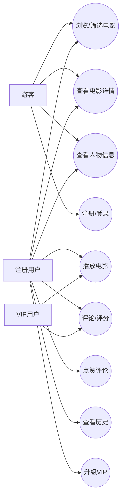
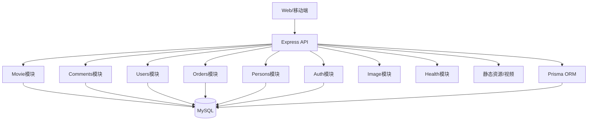
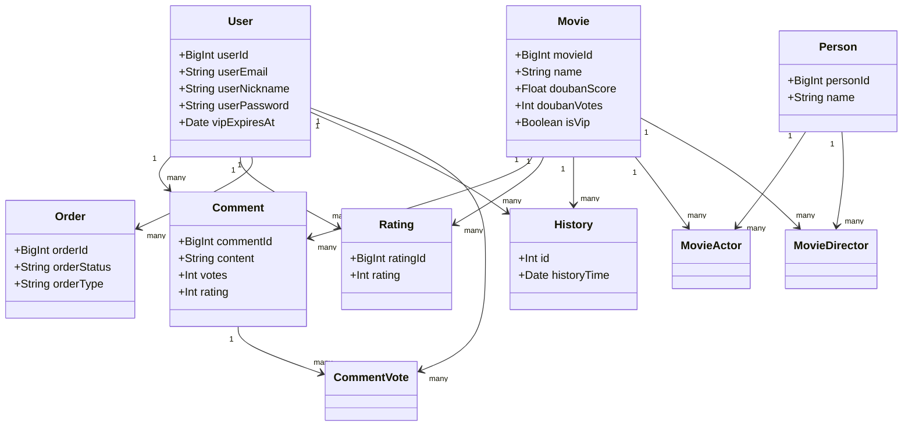
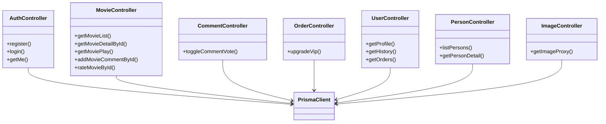
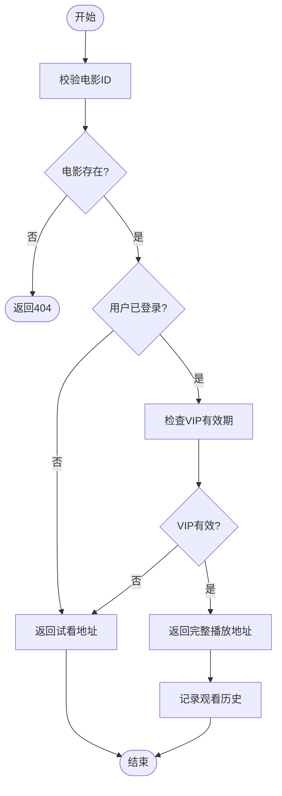
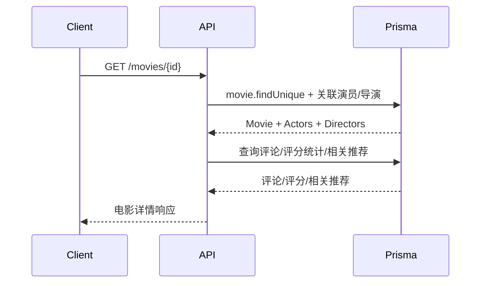

# 电影资源服务系统软件工程文档

## 1. 项目概述
本项目为基于 Node.js + Express 的电影资源服务端，提供电影浏览、详情查询、评论评分、VIP 播放与订单升级等功能。数据持久化使用 MySQL，ORM 使用 Prisma，鉴权采用 JWT。

## 2. 需求分析

### 2.1 需求调查表（摘要）
| 编号 | 需求点 | 典型场景/来源 | 描述 | 优先级 |
| --- | --- | --- | --- | --- |
| R1 | 电影浏览与筛选 | 用户浏览电影库 | 支持分页、按类型/地区/关键词筛选、按时间/评分/热度排序 | 高 |
| R2 | 电影详情 | 观影决策 | 展示演员导演、剧情、评分统计、相关推荐、评论 | 高 |
| R3 | 播放与试看 | 观看电影 | 普通用户可试看，VIP 可完整播放 | 高 |
| R4 | 用户注册/登录 | 账号体系 | 邮箱注册、登录、获取个人信息 | 高 |
| R5 | 评论与评分 | 用户互动 | 发表评论、可选评分 1-5；评分可单独提交 | 高 |
| R6 | 评论点赞 | 互动反馈 | 用户对评论点赞/取消点赞 | 中 |
| R7 | 观看历史 | 追踪观看 | 登录用户播放时记录历史，支持分页查询 | 中 |
| R8 | VIP 购买 | 增值服务 | 购买指定月数 VIP，生成订单并延长有效期 | 高 |
| R9 | 人物信息 | 电影相关 | 支持演员/导演搜索与详情 | 中 |
| R10 | 图片代理 | 外部资源展示 | 代理请求第三方图片，避免跨域/防盗链 | 中 |
| R11 | 健康检查 | 运维需求 | 提供健康状态与运行时长 | 低 |

### 2.2 用例图


### 2.3 需求描述与分析
**功能需求**
- 电影列表支持分页、排序（time/score/hot）与筛选（类型、地区、关键词）。
- 电影详情包含演员导演、评论列表、评分统计、相关推荐。
- 播放接口判断 VIP 权限：VIP 完整播放，非 VIP 返回试看地址。
- 用户注册/登录使用邮箱 + 密码，JWT 鉴权。
- 评论支持评分（1-5），点赞支持切换。
- 观看历史按用户记录，可分页查询。
- VIP 升级生成订单并更新用户有效期。
- 人物（演员/导演）支持搜索与详情查询。
- 图片代理提供第三方图片拉取与缓存头。

**非功能需求**
- 可用性：健康检查接口提供状态与运行时间。
- 性能：列表查询分页、评论仅取最新 N 条。
- 安全：JWT 鉴权、密码 bcrypt 加密、基础参数校验。
- 可维护性：模块化路由与控制器分层。

**业务规则/约束**
- 评分范围为 1-5。
- VIP 判断基于 `vipExpiresAt` 与当前时间。
- 视频文件位于 `public/videos`，命名 `movie_{id}.mp4` 与 `movie_{id}_trial.mp4`。

## 3. 项目可行性分析

### 3.1 经济可行性（成本分析）
- 开发成本：Node.js/Express/Prisma/TypeScript 均为开源，学习成本低；小型团队可完成。
- 运行成本：单体服务 + MySQL 可低成本部署；视频文件需额外存储与带宽预算。
- 维护成本：模块化代码结构与 ORM 降低维护成本。

### 3.2 技术可行性
- 技术栈成熟：Express 生态完善，Prisma 适配 MySQL 并具备迁移能力。
- 鉴权可行：JWT + bcrypt 满足基础安全要求。
- 静态资源可行：Express 可直接托管 `public` 与视频目录。
- 可扩展性：业务模块拆分清晰，后续可拆分为独立服务。

### 3.3 运行与风险可行性（简述）
- 运维：健康检查、日志输出满足基础运维监控。
- 风险：视频带宽与版权合规；图片代理需限制超时与类型（已设置超时与类型检查）。

## 4. 项目设计

### 4.1 概要设计

**系统总体架构**


**模块组织结构图**
```mermaid
flowchart LR
  Routes[/api] --> AuthRoutes[/auth]
  Routes --> UserRoutes[/users]
  Routes --> MovieRoutes[/movies]
  Routes --> PersonRoutes[/persons]
  Routes --> CommentRoutes[/comments]
  Routes --> OrderRoutes[/orders]
  Routes --> ImageRoutes[/images]
  Routes --> HealthRoutes[/health]
```

**分析类图（领域模型）**


**数据库概要设计**
- 核心表：`user`、`movie`、`person`、`comment`、`rating`、`order`、`history`。
- 关系表：`movie_actor`、`movie_director`、`comment_vote`。

### 4.2 详细设计

**服务/控制器类图**


**活动图：播放电影（VIP/试看）**


**时序图：获取电影详情**


**关键流程说明**
- 电影列表：根据筛选条件构建查询条件，支持分页与排序。
- 评论/评分：有评分时在事务内写入 `comment` 与 `rating`，确保一致性。
- 点赞评论：存在则取消，反之新增；点赞数在事务内更新。
- VIP 升级：创建订单并更新用户 VIP 到期时间。

## 5. 项目实现

**技术栈与结构**
- 语言：TypeScript
- 框架：Express
- ORM：Prisma
- 数据库：MySQL
- 认证：JWT + bcrypt

**主要接口（摘要）**
- `POST /api/auth/register` 注册
- `POST /api/auth/login` 登录
- `GET /api/auth/me` 获取当前用户
- `GET /api/movies` 电影列表（分页、筛选、排序）
- `GET /api/movies/featured` 推荐数据
- `GET /api/movies/rankings/:type` 电影榜单
- `GET /api/movies/:id` 电影详情
- `GET /api/movies/:id/play` 获取播放信息（VIP/试看）
- `POST /api/movies/:id/comments` 发表评论
- `POST /api/movies/:id/ratings` 评分
- `POST /api/movies/:id/history` 记录历史
- `POST /api/comments/:id/vote` 评论点赞
- `GET /api/users/me` 用户信息
- `GET /api/users/me/history` 观看历史
- `GET /api/users/me/orders` 订单列表
- `POST /api/orders/vip` VIP 升级
- `GET /api/persons` 人物列表
- `GET /api/persons/:id` 人物详情
- `GET /api/images/proxy?url=...` 图片代理
- `GET /api/health` 健康检查

**关键实现点**
- 列表分页通过 `skip/take` 实现；排序根据 `time/score/hot` 切换。
- 详情接口返回评论、评分统计与相关推荐；相关推荐使用随机查询。
- VIP 播放逻辑基于用户登录与 `vipExpiresAt` 判断。
- BigInt JSON 序列化做统一处理，保证接口输出兼容。

## 6. 项目分工说明

**角色分工**
- 产品/项目经理：需求调研、范围控制、里程碑管理。
- 后端开发：API 设计与实现、鉴权、安全与性能优化。
- 数据库工程师：数据建模、索引设计、迁移策略。
- 前端开发：页面/交互实现、接口对接、播放器与会员提示。
- 测试工程师：用例设计、接口测试、性能与回归测试。
- 运维/DevOps：环境部署、日志监控、备份与发布流程。

**协作方式**
- 需求评审后固化 API 规范，前后端并行开发。
- 使用分支策略与代码评审保证质量。
- 每个迭代进行联调、测试与回归验收。
